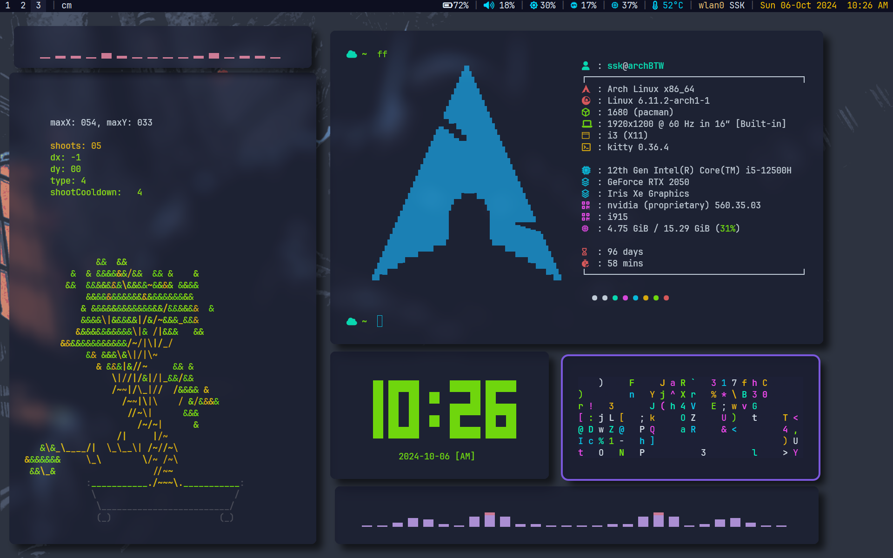
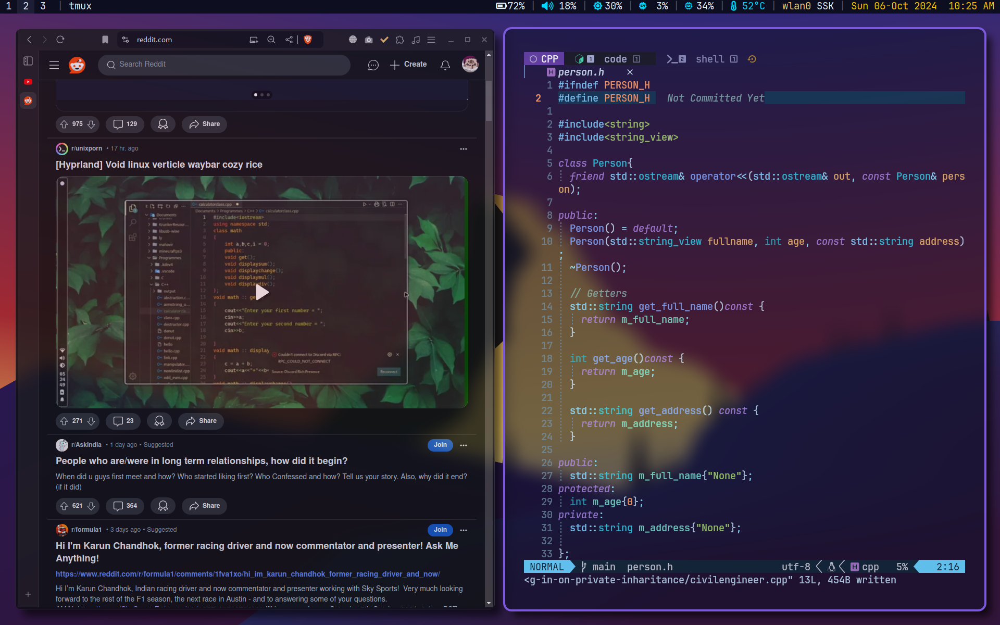
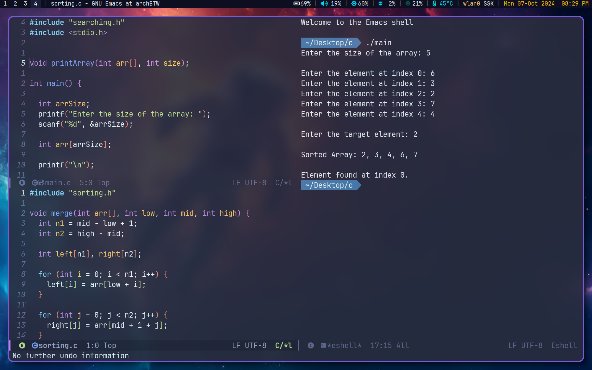

# DOT FILES

    - NVIM Config
    - TMUX Config
    - ZSH Config
    - Kitty config
    - Alacritty config
    - Rofi config
    - I3 config
    - Polybar config
    - Picom config
    - Emacs config
    - Xborders config
    - fastfetch config

---

## Rice

--- 

## NVIM Config && Brave

---

## Emacs 

