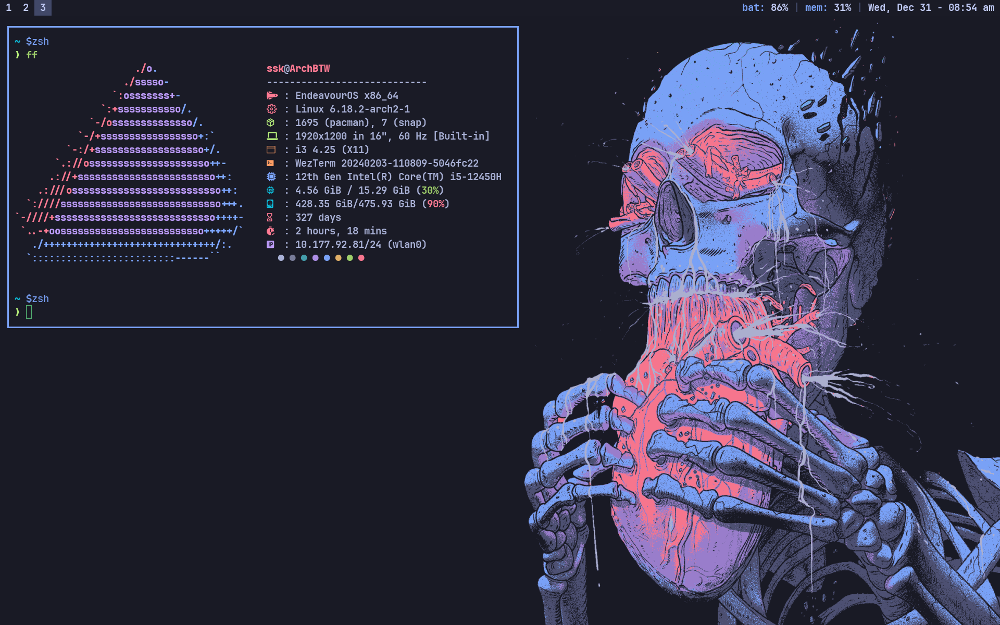

# 🚀 Dotfiles - Professional Development Environment

A comprehensive, production-ready dotfiles repository for **Arch Linux** featuring **Hyprland**, **Noctalia Shell**, and the **Tokyo Night** color scheme. Fully automated installation with professional tooling for modern development workflows.

<div align="center">


</div>

---

## 📸 Preview



---

## ✨ Features

### 🎨 **Visual Environment**

- **Window Manager**: Hyprland (Dynamic tiling Wayland compositor)
- **Desktop Shell**: Noctalia Shell (Modern, feature-rich shell)
- **Color Scheme**: Tokyo Night (Consistent across all applications)
- **Font**: JetBrains Mono Nerd Font (Coding ligatures + icons)
- **Cursor Theme**: Bibata Modern Ice
- **Icons**: Papirus + Font Awesome

### 💻 **Terminal Setup**

- **Shell**: ZSH with Oh My Zsh
- **Prompt**: Starship (Fast, customizable)
- **Multiplexer**: tmux with custom Tokyo Night theme
- **Emulators**: Ghostty, Kitty, Alacritty, WezTerm, Foot

### 🛠️ **Development Tools**

- **Editor**: Neovim (Extensive Lua configuration with LSP, Treesitter, Telescope)
- **Version Control**: Git + Lazygit + GitHub CLI
- **Languages**: Go, Rust, Node.js, Python, C/C++
- **Containers**: Docker + Docker Compose + Lazydocker
- **IDEs**: VS Code, Cursor

### 🔧 **Modern CLI Tools** (Rust-based)

| Traditional   | Modern Alternative | Purpose                      |
| ------------- | ------------------ | ---------------------------- |
| `ls`          | `eza`              | Enhanced file listing        |
| `cat`         | `bat`              | Syntax highlighting          |
| `cd`          | `zoxide`           | Smarter directory navigation |
| `find`        | `fd`               | Fast file finder             |
| `grep`        | `ripgrep`          | Lightning-fast search        |
| `top`         | `btop`             | System monitor               |
| `du`          | `dust`             | Disk usage analyzer          |
| File explorer | `yazi`             | Terminal file manager        |

---

## 📦 Included Configurations

<details>
<summary><b>🖥️ Window Managers & Compositors</b></summary>

- **Hyprland** - Main setup with custom animations and rules
- **i3** - X11 alternative
- **Sway** - Wayland i3 replacement
- **Niri** - Scrollable tiling compositor

**Status Bars**: Waybar, Polybar  
**Launchers**: Rofi, Tofi, Wofi  
**Notifications**: Dunst, Mako  
**Lock Screens**: Hyprlock, Swaylock, Betterlockscreen

</details>

<details>
<summary><b>🐚 Shell Configuration</b></summary>

**Modular ZSH Setup** (`.config/zsh/`):

- `options.zsh` - ZSH options and behavior
- `completion.zsh` - Completion settings
- `plugins.zsh` - Oh My Zsh plugins
- `aliases.zsh` - Command aliases (200+ aliases)
- `keybindings.zsh` - Custom key bindings
- `env.zsh` - Environment variables
- `paths.zsh` - PATH configuration
- `functions.zsh` - Custom shell functions
- `tools.zsh` - FZF, Zoxide integrations

**Plugins**:

- zsh-autosuggestions (Fish-like suggestions)
- zsh-syntax-highlighting (Command validation)

</details>

<details>
<summary><b>📝 Neovim Configuration</b></summary>

**Plugin Manager**: lazy.nvim

**Key Plugins**:

- **LSP**: Mason, nvim-lspconfig (Language servers)
- **Completion**: nvim-cmp (Auto-completion)
- **Syntax**: Treesitter (Syntax highlighting)
- **Fuzzy Find**: Telescope (File/text search)
- **Git**: Gitsigns, Lazygit integration
- **UI**: Lualine, Bufferline, Alpha (Dashboard)
- **File Explorer**: Oil.nvim, Mini.files
- **Formatting**: Conform.nvim
- **Linting**: nvim-lint
- **AI**: Copilot, ChatGPT integration
- **Productivity**: Harpoon, Zen Mode, Which-key

**Features**:

- Tokyo Night color scheme
- LSP-powered code intelligence
- Git integration in editor
- Project-aware session management
- Integrated terminal (floatterm)

</details>

<details>
<summary><b>🖼️ Terminal Emulators</b></summary>

All configured with:

- JetBrains Mono Nerd Font
- Tokyo Night colors
- GPU acceleration
- Ligature support

Available: Ghostty, Kitty, Alacritty, WezTerm, Foot

</details>

---

## 🚀 Installation

### Prerequisites

- Fresh Arch Linux installation
- Internet connection
- Sudo privileges

### Quick Install

```bash
# Clone the repository
git clone https://github.com/2SSK/dot-files.git ~/.dotfiles
cd ~/.dotfiles

# Run the installation
./bootstrap.sh
```

> **Note**: The `bootstrap.sh` script is already executable. If you only want to install packages without dotfiles setup, use `./arch/install.sh` instead.

### Installation Options

**Full Installation** (Recommended):

```bash
./bootstrap.sh
```

**Packages Only** (Lightweight):

```bash
./arch/install.sh
# Only installs packages from packages.txt without dotfiles
```

**Custom Installation** (Choose components):

```bash
./bootstrap.sh
# Then select option 2 from the menu
```

**Skip Specific Components**:

```bash
./bootstrap.sh --no-packages    # Skip package installation
./bootstrap.sh --no-dotfiles    # Skip dotfiles setup
./bootstrap.sh --no-shell       # Skip shell configuration
./bootstrap.sh --no-nvim        # Skip Neovim setup
./bootstrap.sh --no-hyprland    # Skip Hyprland setup
./bootstrap.sh --no-themes      # Skip theme installation
```

### What Gets Installed

1. **AUR Helper**: yay (for AUR package management)
2. **System Packages**: 100+ packages from [packages.txt](arch/packages.txt)
3. **Dotfiles**: Symlinked via GNU Stow
4. **Shell Environment**: ZSH + Oh My Zsh + plugins + Starship
5. **Neovim**: Full IDE-like setup (plugins install on first launch)
6. **Hyprland**: Complete Wayland environment
7. **Fonts & Themes**: JetBrains Mono Nerd Font + Tokyo Night + Bibata cursors

---

## 📚 Post-Installation

### 1. Restart Your System

```bash
reboot
```

### 2. Select Hyprland from Display Manager

Login and choose "Hyprland" session

### 3. Launch Terminal

Default terminal: Ghostty (or kitty, alacritty)

### 4. Initialize Neovim Plugins

```bash
nvim
# Lazy.nvim will auto-install plugins on first launch
```

### 5. Configure Git

```bash
git config --global user.name "Your Name"
git config --global user.email "your.email@example.com"
```

### 6. Generate SSH Keys (if needed)

```bash
ssh-keygen -t ed25519 -C "your.email@example.com"
```

---

## 🎮 Key Bindings

### Hyprland

| Keybind                 | Action                    |
| ----------------------- | ------------------------- |
| `Super + Enter`         | Launch terminal           |
| `Super + Q`             | Close window              |
| `Super + Space`         | Toggle floating           |
| `Super + F`             | Fullscreen                |
| `Super + [1-9]`         | Switch workspace          |
| `Super + Shift + [1-9]` | Move to workspace         |
| `Super + P`             | Session menu (power/lock) |
| `Super + Shift + B`     | Toggle bar                |
| `F12`                   | Screenshot (full screen)  |
| `Ctrl + F12`            | Screenshot (region)       |
| `Shift + F12`           | Screenshot (window)       |

### Tmux

| Keybind        | Action                         |
| -------------- | ------------------------------ |
| `` ` ``        | Prefix key (instead of Ctrl+B) |
| `` ` c``       | New window                     |
| `` ` [0-9]``   | Switch window                  |
| `` ` %``       | Split vertical                 |
| `` ` "``       | Split horizontal               |
| `` ` h/j/k/l`` | Navigate panes (Vim-style)     |

### Neovim (Leader: Space)

| Keybind      | Action               |
| ------------ | -------------------- |
| `Space + ff` | Find files           |
| `Space + fg` | Live grep            |
| `Space + fb` | Find buffers         |
| `Space + e`  | Toggle file explorer |
| `Space + lg` | Open Lazygit         |
| `Space + /`  | Toggle comment       |
| `gd`         | Go to definition     |
| `K`          | Hover documentation  |

---

## 🔧 Customization

### Changing Theme Colors

Edit respective config files:

- **Hyprland**: [.config/hypr/hyprland.conf](.config/hypr/hyprland.conf)
- **Neovim**: [.config/nvim/lua/config/plugins/colorscheme.lua](.config/nvim/lua/config/plugins/colorscheme.lua)
- **Tmux**: [.tmux.conf](.tmux.conf)
- **Terminal**: Individual terminal configs in `.config/`

### Adding More Packages

Edit [arch/packages.txt](arch/packages.txt) and run:

```bash
cd ~/.dotfiles
./bootstrap.sh --no-dotfiles --no-shell --no-nvim --no-hyprland --no-themes
```

### Personal Overrides

Create `~/.config/zsh/local.zsh` for personal shell settings (gitignored).

---

## 📜 Scripts

### Git Profile Switcher

Switch between work and personal Git accounts:

```bash
# Switch to work profile
./scripts/git-switch.sh work

# Switch to personal profile
./scripts/git-switch.sh personal
```

### Screen Recorder

Record your screen with optional audio:

```bash
./scripts/record_screen.sh
```

---

## 🗂️ Directory Structure

```
.
├── bootstrap.sh              # Main installation script
├── install.sh                # Legacy installer (use bootstrap.sh)
├── README.md                 # This file
├── .stow-local-ignore        # Files to ignore when stowing
├── arch/
│   ├── install.sh            # Arch-specific installer
│   └── packages.txt          # Complete package list
├── scripts/
│   ├── git-switch.sh         # Git profile switcher
│   └── record_screen.sh      # Screen recorder
├── screenshots/              # Rice screenshots
├── .config/                  # Application configs
│   ├── nvim/                 # Neovim configuration
│   ├── hypr/                 # Hyprland configuration
│   ├── zsh/                  # Modular ZSH config
│   ├── ghostty/              # Ghostty terminal
│   ├── kitty/                # Kitty terminal
│   ├── alacritty/            # Alacritty terminal
│   ├── waybar/               # Status bar
│   ├── rofi/                 # Launcher
│   ├── dunst/                # Notifications
│   └── ...                   # Other app configs
├── .zshrc                    # ZSH entry point
├── .tmux.conf                # Tmux configuration
├── .vimrc                    # Vim configuration
└── .gitconfig                # Git configuration (template)
```

---

## 🔍 Troubleshooting

### Neovim plugins not loading

```bash
# Remove and reinstall
rm -rf ~/.local/share/nvim
nvim
```

### Hyprland not starting

```bash
# Check logs
cat /tmp/hypr/$(ls -t /tmp/hypr/ | head -n 1)/hyprland.log
```

### Fonts not displaying correctly

```bash
# Rebuild font cache
fc-cache -fv
```

### Stow conflicts

```bash
# Backup and remove conflicting files
mv ~/.zshrc ~/.zshrc.backup
cd ~/.dotfiles
stow --restow .
```

---

## 🤝 Contributing

Contributions are welcome! Feel free to:

- Report bugs
- Suggest features
- Submit pull requests
- Share your customizations

---

## 📄 License

This project is licensed under the MIT License - see the [LICENSE](LICENSE) file for details.

---

## 🙏 Acknowledgments

- [Tokyo Night Theme](https://github.com/tokyo-night/tokyo-night-vscode-theme)
- [Hyprland](https://hyprland.org/)
- [Neovim](https://neovim.io/)
- [Oh My Zsh](https://ohmyz.sh/)
- [Noctalia Shell](https://github.com/noctalia/noctalia-shell)
- All the amazing open-source contributors

---

## 📞 Contact

- **GitHub**: [@2SSK](https://github.com/2SSK)
- **Email**: your.email@example.com

---

<div align="center">

**⭐ If you find this helpful, please consider giving it a star!**

Made with ❤️ and lots of ☕

</div>
