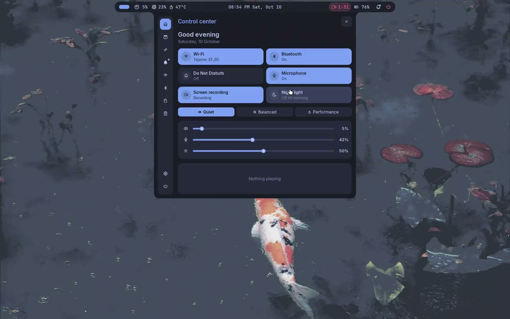

# dot-files

My Arch Linux desktop: **sway (swayfx)** and **i3** sharing one config, with a
[Quickshell](https://quickshell.org) desktop shell, and one theme that colours everything.

[](docs/preview.mp4)

<p align="center"><a href="docs/preview.mp4">▶ Watch the preview</a> (4 min)</p>

- **Desktop shell** (`qs -c desktop`): a floating "island" bar per screen, control center (Wi-Fi,
  Bluetooth, power profiles, media, calendar, notes, todo), launcher, clipboard history,
  notifications, screenshots and recording, wallpapers, lock screen and settings, the same on
  sway and i3.
- **One theme**: pick a palette (8 families, dark and light) and kitty, foot, nvim, tmux, GTK, Qt,
  i3/sway, the shell, the login screen and GRUB follow it live.
- **Terminal**: zsh, tmux (sessions restored at login), Neovim with LSP and Copilot, yazi.
- **System**: TLP power profiles and an 80% charge limit, zram and systemd-oomd, Timeshift
  snapshots, a themed GRUB and SDDM.

## Install

Runs on **Arch** (and derivatives such as EndeavourOS) and **Fedora 43+**. `setup.sh` checks
this before changing anything.

```sh
git clone https://github.com/2SSK/dot-files ~/dot-files
cd ~/dot-files
./setup.sh   # asks first: packages, shell plugins, links into ~, the theme, zsh, and the system
             # parts (zram, laptop power and lid, Timeshift, GRUB and login screen, VMs, docker)
```

The system parts run as one: `packages/system.sh` sets up everything that applies to the machine
(`--plan` lists it), or name parts to run just those (`packages/system.sh power grub`).

`setup.sh --help` lists its options (`--wm sway|i3|both`, `--dev`, `-y`). Everything is linked
with [GNU Stow](https://www.gnu.org/software/stow/): `stow .` links, `stow -R .` restows,
`stow -D .` unlinks.

## Docs

| | |
|---|---|
| [desktop-shell](docs/desktop-shell.md) | the bar, panels, keys and settings |
| [theme](docs/theme.md) | how a theme is rendered and applied |
| [shell](docs/shell.md) · [tmux](docs/tmux.md) · [nvim](docs/nvim.md) · [git](docs/git.md) | the terminal side |
| [ai](docs/ai.md) · [music](docs/music.md) · [postgres](docs/postgres.md) · [vm](docs/vm.md) | tools |

## License

[MIT](LICENSE)
